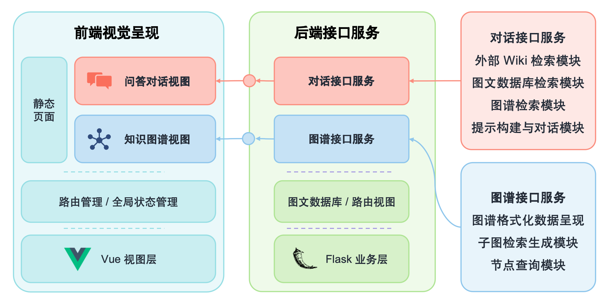

# CCUS-CT: 基于知识图谱的智能对话系统

> 本项目基于 [KnowledgeGraph-based-on-Raw-text-A27](https://github.com/littlewwwhite/KnowledgeGraph-based-on-Raw-text-A27) 进行改造，专门用于CCUS（Carbon Capture, Utilization and Storage）领域的知识图谱构建和智能对话。

## 项目简介
这是一个基于知识图谱和知识库的大模型对话系统，特别针对CCUS技术领域进行了优化和定制。

## 项目整体流程介绍
#### 项目整体包含5个部分：数据预处理、图谱构建、图谱补全、对话模型、网页呈现

### 首先是数据预处理的逻辑

### 然后利用数据和ChatGPT定义的规则构建种子知识图谱

### 接着对种子知识图谱进行补全操作（需要对自己的数据进一步的筛选，有更深的认知）

### 利用chatglm-6b作为核心模型，基于flask构建后端的对话模型

### 前端界面构建和项目部署

## 环境配置

---
python                    3.8.16
torch                     1.11.0+cu113~
paddlenlp                 2.5.1
paddlepaddle-gpu          2.3.2
transformer               **2.6.0**

## 初始模型：
---
知识种子图图谱模型：paddlenlp-model-zoo-uie
所用模型类型：'information extraction'

##  训练模型：SPN4RE-NYT—exact
---
训练集占比：50%
验证集占比：10%
测试集占比：40%

## 数据来源：
---
针对CCUS技术领域的专业文献和技术资料进行知识抽取和图谱构建。

## 数据标注
利用标注工具对CCUS相关的技术文档进行标注，构建领域专业知识图谱。

## 技术特点
- 支持多种数据源的知识抽取
- 基于大模型的智能对话
- 可视化知识图谱展示
- Web界面友好交互

## 作者信息
- 作者：huh7i5
- 邮箱：1322133227@qq.com
- GitHub：https://github.com/huh7i5/ccus-ct

## 致谢
感谢原项目 [littlewwwhite/KnowledgeGraph-based-on-Raw-text-A27](https://github.com/littlewwwhite/KnowledgeGraph-based-on-Raw-text-A27) 提供的技术基础。

