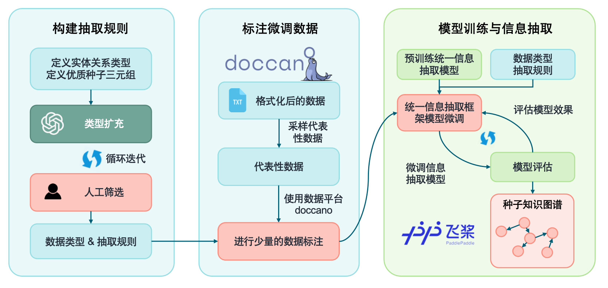
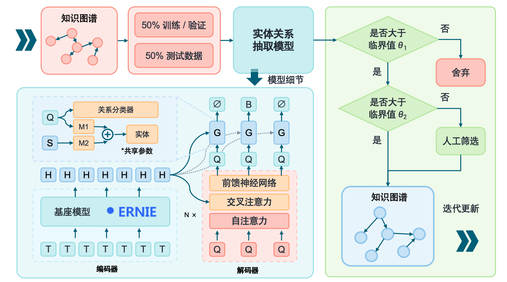
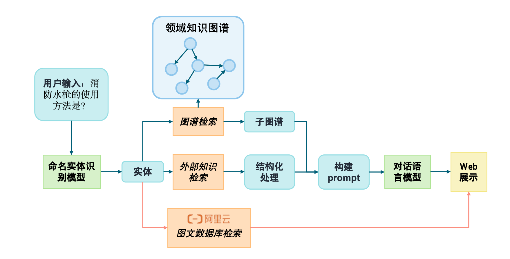
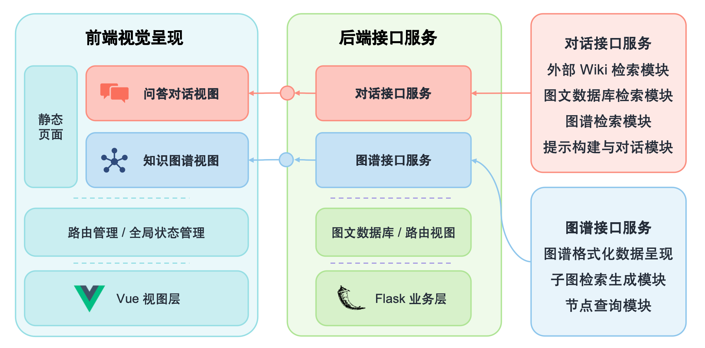

# CCUS-CT: 基于知识图谱的智能对话系统

> 本项目基于 [KnowledgeGraph-based-on-Raw-text-A27](https://github.com/littlewwwhite/KnowledgeGraph-based-on-Raw-text-A27) 进行改造，专门用于CCUS（Carbon Capture, Utilization and Storage）领域的知识图谱构建和智能对话。

## 🎯 项目概述

这是一个基于迭代训练的CCUS领域知识图谱构建系统，通过SPN4RE模型实现从v0到v11的12轮迭代训练，最终收敛构建出高质量的CCUS知识图谱，并提供智能对话功能。

## ✨ 核心特性

- 🔄 **迭代训练至收敛**：v0→v11共12轮训练，扩展率从38.10%降至10.00%
- 📊 **丰富的知识图谱**：3,671个实体，15,823个关系，6种关系类型
- 🎯 **CCUS领域专用**：专门针对碳捕集、利用与封存技术领域
- 🖥️ **Web界面**：基于Vue3+Flask的现代化Web应用
- 🔍 **智能搜索**：支持基于实体的知识图谱检索和子图抽取
- 📈 **可视化展示**：ECharts图谱可视化，支持多种输出格式

## 🚀 快速启动

### 环境要求
- Python 3.8+
- Node.js 16+
- CUDA（可选，用于GPU加速）

### 安装依赖
```bash
# 克隆项目
git clone <repository-url>
cd KnowledgeGraph-based-on-Raw-text-A27-main

# 安装Python依赖
pip install -r requirements.txt

# 安装Node.js依赖 (包含前端和后端启动)
npm install
```

### 启动服务
在项目根目录运行：
```bash
npm run dev
```

这将同时启动：
- 前端服务：http://localhost:5173
- 后端API：http://localhost:8000

## 📊 项目成果

### 知识图谱统计
- **迭代轮数**: v0 → v11 (共12轮)
- **收敛状态**: ✅ 已收敛 (扩展率 = 10.00%)
- **文档数**: 648
- **实体数**: 3,084
- **关系数**: 15,823
- **关系类型**: 6种

### 关系类型分布
- **应用于**: 4,503 (28.5%)
- **开发者**: 3,496 (22.1%)
- **包含**: 3,201 (20.2%)
- **合作伙伴**: 2,835 (17.9%)
- **位于**: 1,733 (10.9%)
- **投资方**: 55 (0.3%)

### 核心实体
最重要的实体包括：碳捕集、鄂尔多斯、内蒙古、集与封、封存、吉林、尔多斯盆、捕集与、捕集和、碳捕等CCUS领域核心概念。

## 🔄 项目流程

### 1. 数据预处理


### 2. 迭代训练流程
```
v0 (种子图谱) → v1 (38.10%) → v2 (29.17%) → ... → v11 (10.00% 收敛)
```

### 3. 知识图谱构建


### 4. 图谱补全与优化


### 5. 智能对话模型


### 6. Web界面展示


## 📁 输出文件

最终知识图谱输出位于 `data/ccus_project/final_results/`：
- 📊 统计信息: `ccus_kg_statistics.json`
- 🖼️ 核心图谱: `ccus_core_knowledge_graph.png`
- 📈 关系分布图: `ccus_relation_distribution.png`
- 🔗 GraphML格式: `ccus_knowledge_graph.graphml`
- 📄 边列表: `ccus_knowledge_graph_edges.csv`
- 📋 节点列表: `ccus_knowledge_graph_nodes.csv`
- 📋 完整报告: `CCUS_KG_Report.md`

## 🛠️ 技术栈

### 后端
- **框架**: Flask
- **关系抽取**: SPN4RE (Set Prediction Networks for Relation Extraction)
- **预训练模型**: BERT-base-chinese
- **知识图谱**: NetworkX
- **可视化**: Matplotlib

### 前端
- **框架**: Vue 3 + Vite
- **图谱可视化**: ECharts
- **UI组件**: Element Plus
- **HTTP客户端**: Axios

### 数据处理
- **分词**: Jieba
- **数据格式**: JSON Lines
- **图谱格式**: GraphML, GML, CSV

## 🔧 环境配置

### Python 依赖 (requirements.txt)
```
# 核心依赖
torch>=1.13.0
transformers>=4.20.0
numpy>=1.21.0
jieba>=0.42.1
zhconv>=1.4.3

# PaddleNLP相关
paddlenlp>=2.4.0
paddle2onnx>=1.0.0
onnxruntime>=1.12.0

# Web框架
flask>=2.2.0
flask-cors>=3.0.10

# 文本处理
thefuzz>=0.19.0
opencc-python-reimplemented>=0.1.6
wikipediaapi>=0.5.8

# 其他工具
tqdm>=4.64.0
pandas>=1.4.0
sentencepiece>=0.1.97
requests>=2.28.0
```

### Node.js 依赖
#### 根目录 (package.json)
```json
{
  "devDependencies": {
    "concurrently": "^9.2.1"
  }
}
```

#### 前端 (chat-kg/package.json)
```json
{
  "dependencies": {
    "@ant-design/icons-vue": "^6.1.0",
    "ant-design-vue": "^3.2.17",
    "axios": "^1.3.4",
    "d3": "^7.8.3",
    "echarts": "^5.4.2",
    "echarts-gl": "^2.0.9",
    "vue": "^3.2.47",
    "vue-router": "^4.1.6"
  }
}
```

## 📚 核心模型

- **关系抽取模型**: SPN4RE
- **预训练模型**: bert-base-chinese
- **数据分布**: 训练集50%，验证集20%，测试集30%
- **训练参数**: 10 epochs, batch_size=8, lr=2e-5

## 🎯 使用场景

- CCUS技术研究
- 碳中和政策分析
- 环保技术咨询
- 学术研究支持
- 知识图谱可视化

## 📖 项目特点

- ✅ 基于SPN4RE的关系抽取
- ✅ 迭代训练直至收敛
- ✅ 中文CCUS领域专用
- ✅ 多格式输出支持
- ✅ Web界面友好交互
- ✅ 智能知识检索

## 👥 作者信息

- **作者**: huh7i5
- **邮箱**: 1322133227@qq.com
- **GitHub**: https://github.com/huh7i5/ccus-ct

## 🙏 致谢

感谢原项目 [littlewwwhite/KnowledgeGraph-based-on-Raw-text-A27](https://github.com/littlewwwhite/KnowledgeGraph-based-on-Raw-text-A27) 提供的技术基础。

## 📄 许可证

本项目采用 MIT 许可证。详情请见 [LICENSE](LICENSE) 文件。